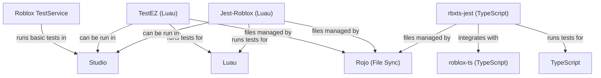

# Testing Tools

This folder contains documentation for all major testing tools used in Roblox development, including:
- TestEZ
- Jest-Roblox
- rbxts-jest
- Roblox TestService
- TestEZ Companion CLI

Use this folder to find setup instructions, best practices, and tool comparisons for automated testing in your Roblox projects. 

## Tool Ecosystem Diagram

This diagram shows how the major testing tools relate to each other and to the broader Roblox development toolchain. 