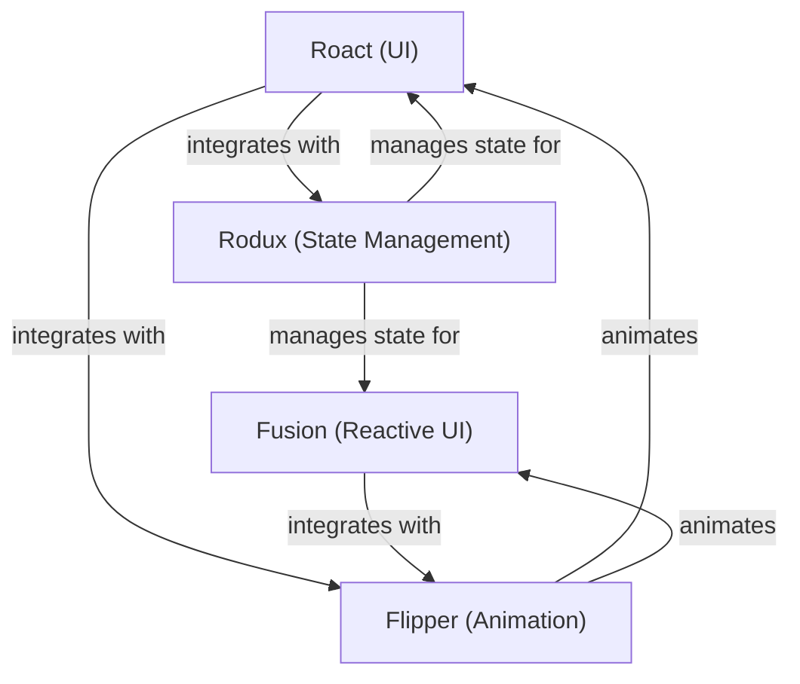

# UI/UX Tools

This folder contains documentation for all major UI/UX frameworks and libraries used in Roblox development, including:
- Roact
- Fusion
- Rodux
- Flipper

Use this folder to find setup instructions, best practices, and tool comparisons for building user interfaces in Roblox games. 

## Tool Ecosystem Diagram

This diagram shows how the major UI/UX tools can be composed in a modern Roblox project. Roact and Fusion are alternative UI frameworks, both of which can use Rodux for state management and Flipper for animations. 