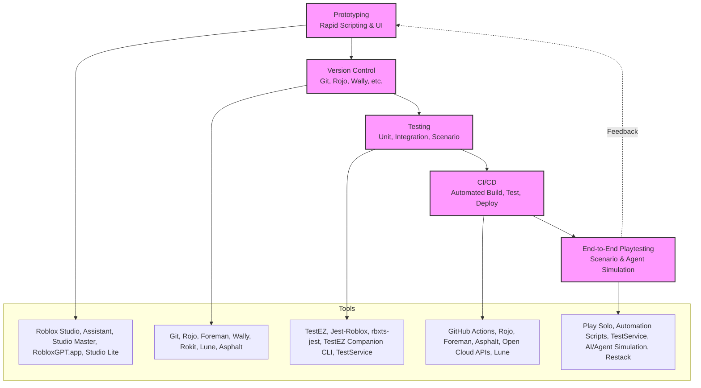

# Master Decisions

## Overall Research Goal
The primary objective of this research is to establish a professional, continuously improving development workflow for a Roblox Family Feud game. The highest priority is to **minimize feedback loop time by making iterations as fast, automated, and low-effort as possible, while reducing any manual actions to the bare minimum**. This enables rapid iteration, high code quality, and reliable delivery.

## High-Level Reasoning
- **Minimize Feedback Loop Time:** Fast feedback enables rapid prototyping, early bug detection, and continuous improvement. Every stage and tool is chosen to automate or accelerate validation, reducing waiting and manual intervention.
- **CI/CD Importance:** Automated build, test, and deployment pipelines ensure that every code change is validated and delivered quickly, reducing risk and manual errors.
- **End-to-End Testing:** Automated scenario and playtesting validate the full player experience, catching integration issues and regressions before release.

## Visual Pipeline Overview
A visual flowchart of the full pipeline, showing how each stage and its tools connect, and how feedback flows back to prototyping:

## Stage Reasoning and Links

### 1. Prototyping
- **Goal:** Enable rapid iteration on game ideas, scripting, and UI.
- **Reasoning:** Fast prototyping tools (Roblox Studio, AI assistants) allow for quick validation of concepts and mechanics.
- [Prototyping/decision.md](Prototyping/decision.md)

### 2. Version Control
- **Goal:** Structure code for collaboration, history, and automation.
- **Reasoning:** Professional version control (Git, Rojo, Foreman) enables safe collaboration, reproducibility, and integration with automation tools.
- [Version_Control/decision.md](Version_Control/decision.md)

### 3. Testing
- **Goal:** Automate unit, integration, and scenario testing.
- **Reasoning:** Automated tests (TestEZ, Jest-Roblox) provide fast, repeatable validation of code, reducing manual QA and catching bugs early.
- [Testing/decision.md](Testing/decision.md)

### 4. CI/CD
- **Goal:** Automate build, test, and deployment pipelines.
- **Reasoning:** CI/CD (GitHub Actions, Rojo, Asphalt) ensures every change is validated and delivered with minimal manual effort, supporting rapid iteration and high reliability.
- [CI_CD/decision.md](CI_CD/decision.md)

### 5. End-to-End Playtesting
- **Goal:** Simulate full game runs for scenario validation.
- **Reasoning:** Automated playtesting (Play Solo, agent simulation) validates the complete player experience, catching integration and gameplay issues before release.
- [End_to_End_Playtesting/decision.md](End_to_End_Playtesting/decision.md)

## How These Stages Work Together
Each stage builds on the previous, forming a feedback-driven development pipeline:
- **Prototyping** enables fast idea validation.
- **Version Control** structures code for safe, collaborative iteration.
- **Testing** automates validation at the code level.
- **CI/CD** automates the entire build, test, and deploy process.
- **End-to-End Playtesting** ensures the final product meets player expectations.

By integrating these stages, the workflow **minimizes feedback loop time by making iterations as fast, automated, and low-effort as possible, while reducing any manual actions to the bare minimum**.

## Peer Review Process
For each section, a peer review file is maintained:
- **Tech Lead Review comments:** Major criticisms, verification, and identification of downfalls or risks in the current approach.
- **Staff Software Engineer comments:** Responses, mitigations, and further suggestions to address the Tech Lead's feedback.

This process ensures that all decisions and documentation are regularly challenged and improved by experienced engineers, maintaining the highest standards of software engineering practice. 